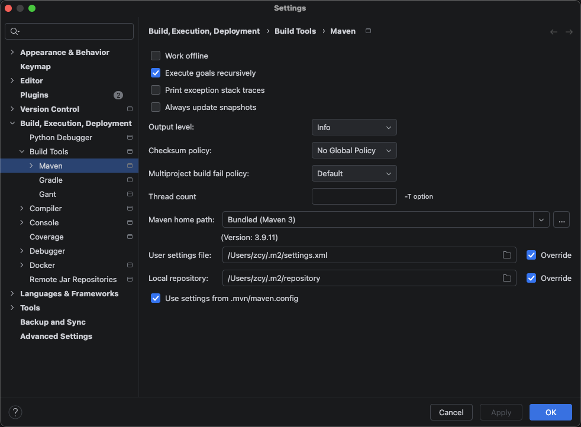

## MyBatis-Plus 入门

今天开始用 Java 代码操作数据库，不再手动敲 SQL。MyBatis-Plus 是 MyBatis 的增强工具，能帮你自动生成大部分 CRUD 代码。


### 增加 MySQL 和 MyBatis-Plus 依赖
```xml
<!-- MySQL 驱动 -->
<dependency>
    <groupId>com.mysql</groupId>
    <artifactId>mysql-connector-j</artifactId>
    <version>8.0.33</version>
</dependency>

<!-- MyBatis-Plus Spring Boot Starter -->
<dependency>
    <groupId>com.baomidou</groupId>
    <artifactId>mybatis-plus-boot-starter</artifactId>
    <version>3.5.9</version>
</dependency>

<!-- Lombok（简化 getter/setter，可选但强烈推荐） -->
<dependency>
    <groupId>org.projectlombok</groupId>
    <artifactId>lombok</artifactId>
    <optional>true</optional>
</dependency>
```
### 遇到的问题

1、Could not create local repository at /Users/pro/.m2/repository

解决

用下面命令查看一下路径是什么，是否跟配置正确
```bash
mvn help:evaluate -Dexpression=settings.localRepository -q -DforceStdout
```
发现输出：/Users/zcy/.m2/repository，跟报错不一致，所以重新配置正确，然后重新relaod maven

Preferences → Build, Execution, Deployment → Build Tools → Maven!



### 配置 application.yml
直接右击 resources（src/main/resources） 创建application.yml文件即可，然后把application.yml 改成：
```yaml
spring:
  datasource:
    url: jdbc:mysql://localhost:3306/fullstack_evolution?useUnicode=true&characterEncoding=utf-8&serverTimezone=Asia/Shanghai
    username: root
    password: root1234   # 改成你实际的 root 密码
    driver-class-name: com.mysql.cj.jdbc.Driver

# MyBatis-Plus 配置
mybatis-plus:
  configuration:
    log-impl: org.apache.ibatis.logging.stdout.StdOutImpl   # 打印 SQL 到控制台
    map-underscore-to-camel-case: true                       # 下划线转驼峰（done → done, create_time → createTime）
```
>注意：数据库名 fullstack_evolution 是你之前建的库，确认无误。


