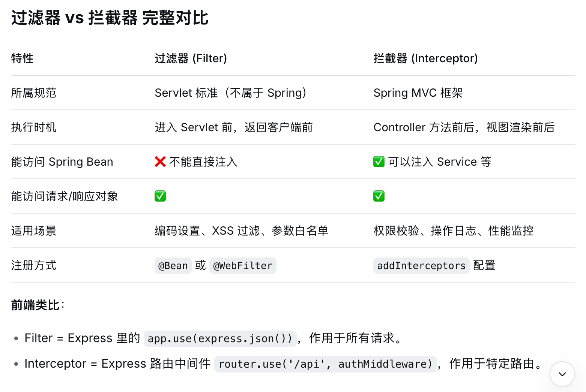

## 如何实现拦截器器
- 1、定义一个类 如 LogInterceptor，并 implements HandlerInterceptor 这个类的实现
- 2、实现的过程中需要重写三个方法：preHandle（表示Controller执行前），postHandle（表示Controller执行后），afterCompletion（表示Controller完全结束后调用），你用到哪个就重写哪个
- 3、最后把这个类注册到Configuration（标注配置类），在这个里面重新 addInterceptors 方法，配置路由

## 如何 跨域
- 1、在这个 Configuration（标注配置类）里面，重写 addCorsMappings方法，配置规则
